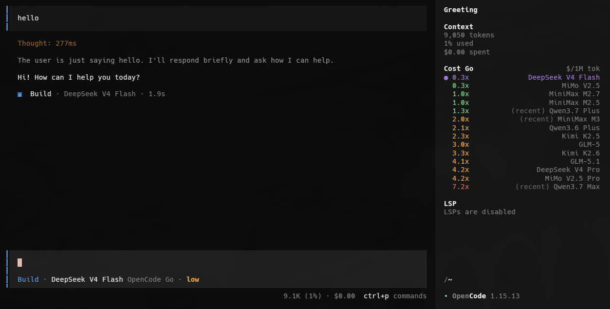

# model-costs

OpenCode TUI plugin that shows LLM model cost multipliers relative to a baseline (`minimax-m2.7`) directly in the sidebar.



## Features

- Shows relative cost per model (`1.0x`, `2.3x`, `10x`, etc.) compared to the cheapest model
- Color-coded: green (≤1.5x), yellow (≤5x), red (>5x)
- Marks models released in the last 30 days as `(recent)`
- Highlights the currently active model
- Toggle sidebar visibility via `/toggle-costs`

## Install

Add to your `~/.config/opencode/opencode.json`:

```json
{
  "plugin": ["model-costs"]
}
```

Restart opencode and the sidebar will appear automatically.

## Usage

- **Toggle**: Run `/toggle-costs` to show/hide the sidebar
- **Colors**: Green = cheap, Yellow = moderate, Red = expensive
- **Recent**: Models with `(recent)` tag were released in the last 30 days

## Links

- [npm](https://www.npmjs.com/package/@aaronsr-54/openode-go-model-costs)
- [GitHub](https://github.com/AaronSR-54/openode-go-model-costs)
